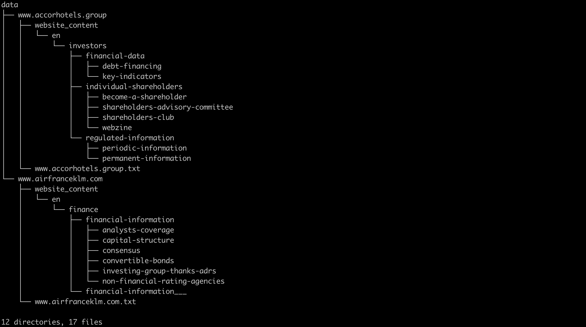

# Tracker Project

Tracker is a website monitoring tool capable of crawling, downloading, and alerting on website content modification.

Actual features:
  - Website crawling
  - Website downloading
  - Website modidification checking
  - Visual interface

Futur features:
  - Email alerts
  - Setting up alerts on modifications
  - Data extraction/Data Mining

### Installation

Tracker requires [Python 3.5](https://www.python.org/downloads/release/python-350/) and [Virtualenv](https://virtualenv.pypa.io/en/latest/) to run.
Clone the git repo.
```sh
$ git clone https://gitlab.com/electricity.ai/tracker.git tracker
```
Create a new fresh virtualenv inside git repo.
```sh
$ cd tracker
$ virtualenv ENV
$ source ENV/bin/activate
```

Now you need to install Rabbitmq because its not available in pip.
Please find more information here: https://www.rabbitmq.com/download.html

#### Two possibilities to launch the program:
1. Launch the program with [supervisord](https://www.supervisord.org)
(you need to create first an environment variable APP_DIR refering to the current repo folder)
```sh
$ export APP_DIR=`cwd`
$ python setup.py install; python setup.py build; supervisord -n -c $APP_DIR/tracker/config/supervisord.conf
```
2. Launch the program with all the commands in different windows (using tmux or screen):
```sh
$ rabbitmq-server
$ redis-server
$ celery worker -A live_view_worker --loglevel=info --hostname w1@%%h --concurrency=10 -Ofair --autoscale 30
$ celery worker -A download_worker --loglevel=info --autoscale 30 --hostname w2@%%h
$ celery worker -A crawl_worker --loglevel=info --autoscale 400 --hostname w3@%%h
$ python setup.py install; python setup.py build; serve_app
```

### Main used frameworks

Tracker uses python framework to complete its operations. 

| Framework | README |
| ------ | ------ |
| Tornado | https://www.tornadoweb.org/ |
| Celery | http://www.celeryproject.org/ |
| Redis | https://redis.io/ |
| BeautifulSoup4 | https://www.crummy.com/software/BeautifulSoup/bs4/doc/ |
| Numpy | http://www.numpy.org/ |
| Pandas | https://pandas.pydata.org/ |
| lxml | https://lxml.de/ |
| requests | http://docs.python-requests.org |
| urllib3 | https://urllib3.readthedocs.io/en/latest/ |
| pdfminer | https://pypi.org/project/pdfminer.six/ |

### How it works
Tracker allow you to create `Project` objects. So far, each project essentially consists of a list of websites to monitor (`Unit` objects). Projects can be loaded by the program either with a .xlsx file containing website list or directly with the appropriate architecture of data storage.

### Project data architecture
Since all data is stored in binary format, the architecture of data storage needs to stricly respect the following rules, as illustrated below:

Here the name of the project is `data`. It contains two websites: `www.accorhotels.group` and `www.airfranceklm.com`.
For each website, there is a directory with the corresponding name, corresponding to a `Unit` object, as explained above. 
In each of these directories, there is :
- a`website_content` folder where downloaded data is stored, keeping the architecture of the website. If there is one HTML document with the same name as a folder, a `'___'`has been append at the end of the HTML file in order to be able to create a the folder and keep the architecture of the website.
- a .txt logfile with the same name  of the websites with all the links that have been crawled

The typical format of the logfile is as follow:
- first line : 
`[2018-10-28 14:17] http://www.accorhotels.group`
- middle :
`<PDF> /-/media/Corporate/Group/PDF-for-pages/Gouvernance/Comites/20180604-Committees.pdf`
- last line : 
`[2018-10-28 14:22] Duration 00:20:52 /Total 432 / Page(s): 167 / PDF(s): 263 / EXCEL(s): 0 / Errors: 2`

### How to set up Nginx reverse proxy
Here is the config file to put in /etc/nginx/site-available
Best practices tell us to make a symbolic link to /etc/nginx/site-enabled also
-> you find the tracker.lu nginx config file in tracker/config/ssl 

### Generate SSL certificate
Go to `https://certbot.eff.org/lets-encrypt/ubuntuxenial-nginx` and follow the instructions ([Tuto](https://www.digitalocean.com/community/tutorials/how-to-secure-nginx-with-let-s-encrypt-on-ubuntu-18-04) or [Nginx](https://docs.nginx.com/nginx/admin-guide/web-server/reverse-proxy/)):
```sh
sudo certbot --nginx -d tracker.lu -d www.tracker.lu
sudo cat /etc/letsencrypt/live/tracker.lu/fullchain.pem
sudo cat /etc/letsencrypt/live/tracker.lu/privkey.pem
```
Test if future certificate auto-renew is ok:
```sh
sudo certbot renew --dry-run
```

### Manage Nginx
Allow HTTP and HTTPS protocols:
```sh
sudo ufw allow 'Nginx HTTP'
sudo ufw allow 'Nginx HTTPS'
sudo ufw app list
```
Enable firewall:
```sh
sudo ufw enable
```
Start, stop, status nginx:
```sh
sudo systemctl start nginx
sudo systemctl stop nginx
sudo systemctl status nginx
```
Test the config file:
```sh
sudo nginx -t
```


